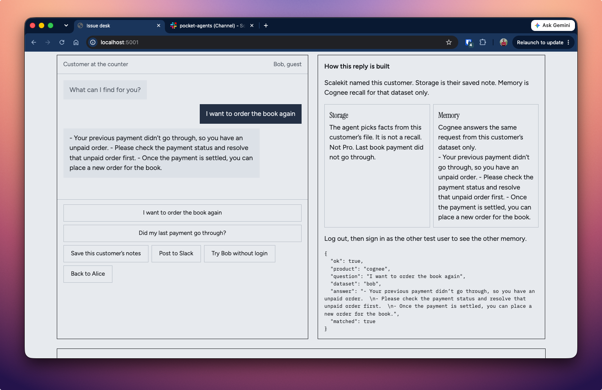
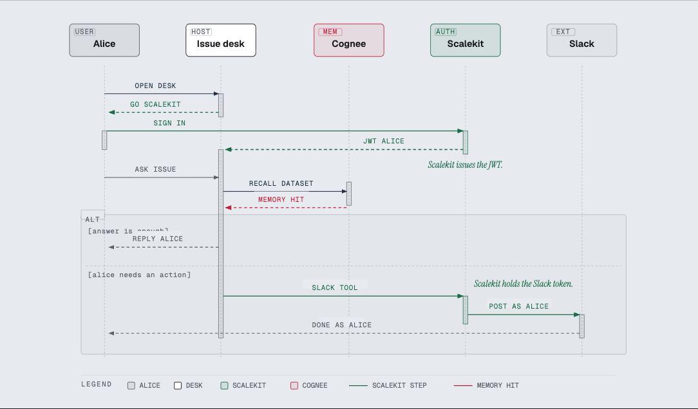
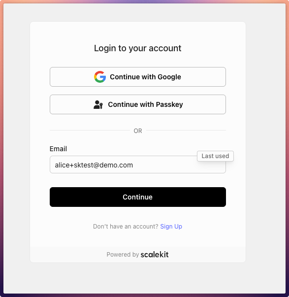
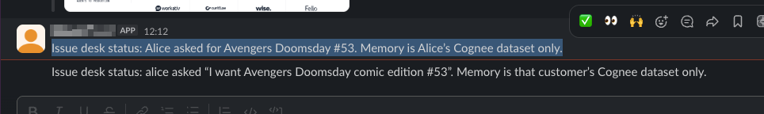

# Book Issue Desk

Local demo of a comic-shop issue desk. Scalekit signs the customer in. Cognee Cloud recalls that customer’s notes.

This repository runs on localhost. Scalekit and Cognee Cloud power it. You do not deploy it.

The desk answers Alice or Bob from that customer’s notes only. Scalekit signs the customer in, and can post to Slack as that customer. Cognee Cloud stores the notes and recalls them when the desk asks. Slack tokens stay in Scalekit. Cognee never receives them.

Alice does not see Bob’s failed payment. Bob does not see Alice’s comic.

The source notes are `fixtures/alice.txt` and `fixtures/bob.txt`. Those files are not memory. You save them into Cognee first. Then a question recalls from that customer’s dataset.

You need a free Cognee Cloud account and a free Scalekit account. Create them in the steps below. The demo calls the live APIs.

## What first success looks like

The desk is working when Bob’s memory answers from Bob’s notes.

1. Open http://localhost:5001
2. Click **Try Bob without login**
3. Click **Save this customer’s notes**
4. Click the fixed question about ordering the book again
5. The reply recalls that Bob’s last payment failed

That path proves Cognee recall without a Scalekit login. The next path signs Alice in with Scalekit. Slack is optional.



## How it works

Scalekit names the signed-in customer. Cognee recalls that customer’s memory. If you post to Slack, Scalekit holds the Slack token and sends the message as that customer.



## What you need on this machine

Install [uv](https://docs.astral.sh/uv/). Use Python 3.12 through `uv`. Homebrew `python3` on some Macs is 3.14. Do not use that interpreter.

You also need a browser and a terminal.

## Create a Cognee Cloud account

Cognee Cloud stores each customer’s memory.

1. Open [Create a Cognee account](https://docs.cognee.ai/cognee-cloud/sign-up).
2. Go to [platform.cognee.ai](https://platform.cognee.ai/sign-up).
3. Sign up with Google, GitHub, or email and password.
4. If you use email, open the verification link, then sign in.
5. Open **API Keys** in the sidebar.
6. Click **Create API key**.
7. Copy the key once. The console shows it only once.
8. Copy the tenant base URL from the same page. It looks like `https://your-tenant.aws.cognee.ai`. Include `https://`.

No credit card is required for the free workspace.

Official guide: [Cognee Cloud sign-up](https://docs.cognee.ai/cognee-cloud/sign-up).

## Create a Scalekit account

This demo uses one Scalekit Development environment for two jobs:

| Job | When you need it | What you configure |
|-----|------------------|--------------------|
| Hosted login | Path 2 below, when Alice or Bob signs in | Redirect URLs, one-time passwords, test users |
| Slack posts as that customer | Optional last section | A Slack connection in the same environment |

Do the login setup here. Slack setup is in [Post to Slack](#optional-post-to-slack).

1. Open [app.scalekit.com](https://app.scalekit.com).
2. Create a free account. Scalekit creates a Development environment for you.
3. Stay in **Development**.
4. Open **Developers → Settings → API Credentials**.
5. Copy `SCALEKIT_ENVIRONMENT_URL`, `SCALEKIT_CLIENT_ID`, and `SCALEKIT_CLIENT_SECRET`.

Official guide: [Scalekit login quickstart](https://docs.scalekit.com/authenticate/fsa/quickstart/).

### Register localhost URLs

Open **Authentication → Redirect URLs**. Add these exact strings:

| Field | URL |
|-------|-----|
| Allowed callback URL | `http://localhost:5001/callback` |
| Initiate login URL | `http://localhost:5001/login` |
| Post logout URL | `http://localhost:5001/` |

The callback URL must match `SCALEKIT_REDIRECT_URI` character for character.

### Enable one-time passwords

Open **Authentication** and enable **Magic Link & OTP**.

Set delivery to **Verification Code**, or to **Magic Link + Verification Code**. Magic Link only does not work with test users.

### Add Alice and Bob as test users

Test users let you sign in with a fixed code. You do not wait for email.

1. Open **Environment settings → Test users**.
2. Enable test users.
3. Add these emails:

   - `alice+sktest@demo.com`
   - `bob+sktest@demo.com`

4. Set the static code to `424242`.
5. Save. Reload the page and confirm the list is still there.

Each email must contain `+sktest` before `@`. Official guide: [Test users](https://docs.scalekit.com/authenticate/run-e2e-tests/).

Login is enough for Path 2. Slack still needs a Slack connection in this same environment.

## Install the app

```bash
git clone https://github.com/scalekit-developers/cogni-x-sample.git
cd cogni-x-sample
uv venv --python 3.12 .venv
uv pip install --python .venv/bin/python -r requirements.txt
cp .env.example .env
```

`.env` is gitignored. Do not commit it.

## Fill `.env`

Open `.env`. Paste the values you copied.

| Variable | Where you get it |
|----------|------------------|
| `COGNEE_API_KEY` | Cognee console → API Keys |
| `COGNEE_BASE_URL` | Same page. Include `https://` |
| `SCALEKIT_ENVIRONMENT_URL` | Scalekit → Developers → Settings → API Credentials |
| `SCALEKIT_CLIENT_ID` | Same page |
| `SCALEKIT_CLIENT_SECRET` | Same page |
| `COOKIE_ENCRYPTION_SECRET` | Generate it: `openssl rand -base64 32` |
| `SCALEKIT_REDIRECT_URI` | Keep `http://localhost:5001/callback` |

Leave `COGNEE_USER_ID`, `COGNEE_TENANT_ID`, and `COGNEE_DATASET` empty unless you already use those names.

## Start the desk

```bash
.venv/bin/uvicorn app:app --host 127.0.0.1 --port 5001
```

Open http://localhost:5001

If port 5001 is already in use, stop the other process first.

## Use the desk

**Alice** is on the shop’s Pro plan. She asks for Avengers: Doomsday #53. Memory should recall she is currently reading #51 and ask if she wants to jump to #53.

**Bob** is not on the Pro plan. He asks to order the book again. Memory should recall the last payment failed and tell him to check payment before a duplicate order.

### Path 1 — Bob without login

Use this path first. It proves Cognee memory.

1. Click **Try Bob without login**.
2. Click **Save this customer’s notes**. Wait until that finishes.
3. Click the fixed question. Wait. The reply is live Cognee recall.
4. The page labels this as guest Bob. This is not a Scalekit login.

### Path 2 — Alice with Scalekit

Use this path next. It proves hosted login.

1. Click **Sign in as Alice**.
2. Enter `alice+sktest@demo.com`.

   

3. Enter OTP `424242`.
4. If the access token has no email, click **Continue as Alice** once.
5. Click **Save this customer’s notes** if you have not seeded Alice yet.
6. Click the fixed Avengers question. Wait. The reply is Alice’s memory.

Log out. Sign in as `bob+sktest@demo.com` if you want Bob through Scalekit instead of the guest button.

The default Scalekit access token includes `sub`. It does not include `email`. That is expected. You do not need a custom email claim for this demo.

If Alice still does not bind after login, copy her user id from the JWT panel. Put it in `.env` as `SCALEKIT_ALICE_SUB=usr_...`. Restart the server.

## Optional: post to Slack

Slack is not required for first success.

1. In the Scalekit dashboard, open **Connections**.
2. Add Slack. Set the connection name to `slack`.
3. Connect your Slack account when the dashboard asks.
4. Set `SLACK_CHANNEL` in `.env` to your channel name, without `#`.
5. In the desk, use the Slack action after you have a customer.

Scalekit stores the Slack token and posts as the signed-in customer. Cognee never receives that token.



## If something fails

| What you see | What to do |
|--------------|------------|
| Missing env error on start | Fill every required row in the table above. Restart uvicorn. |
| Redirect URI mismatch | The dashboard callback URL and `SCALEKIT_REDIRECT_URI` must match exactly. |
| OTP email never arrives | Use the test-user emails and code `424242`. Confirm Magic Link & OTP is on. |
| Empty Cognee reply | Click **Save this customer’s notes**. Wait. Ask again. |
| Python import errors | Recreate `.venv` with `uv venv --python 3.12`. |
| Port already in use | Stop the other process on 5001. |

## Optional CLI

These scripts use the same `.env`.

```bash
.venv/bin/python loop.py --user alice
.venv/bin/python loop.py --user bob
.venv/bin/python slack_post.py --user alice --channel general --text "Acme renews 1 Nov. Refund window is 30 days."
```

## License

[MIT](LICENSE)

Scalekit docs: [login quickstart](https://docs.scalekit.com/authenticate/fsa/quickstart/).  
Cognee docs: [Cloud sign-up](https://docs.cognee.ai/cognee-cloud/sign-up).
